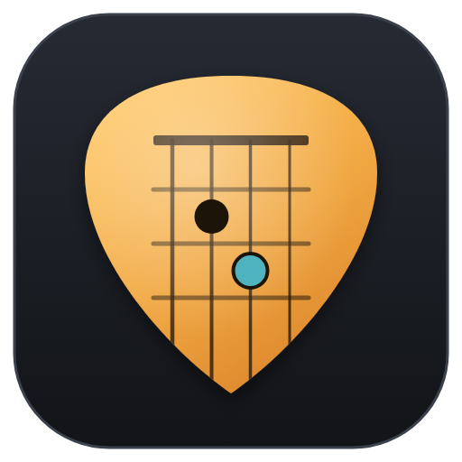
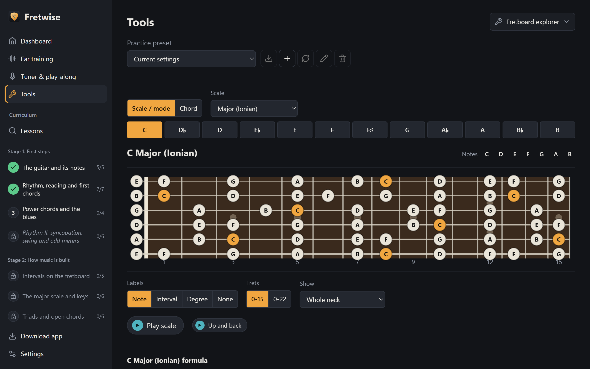
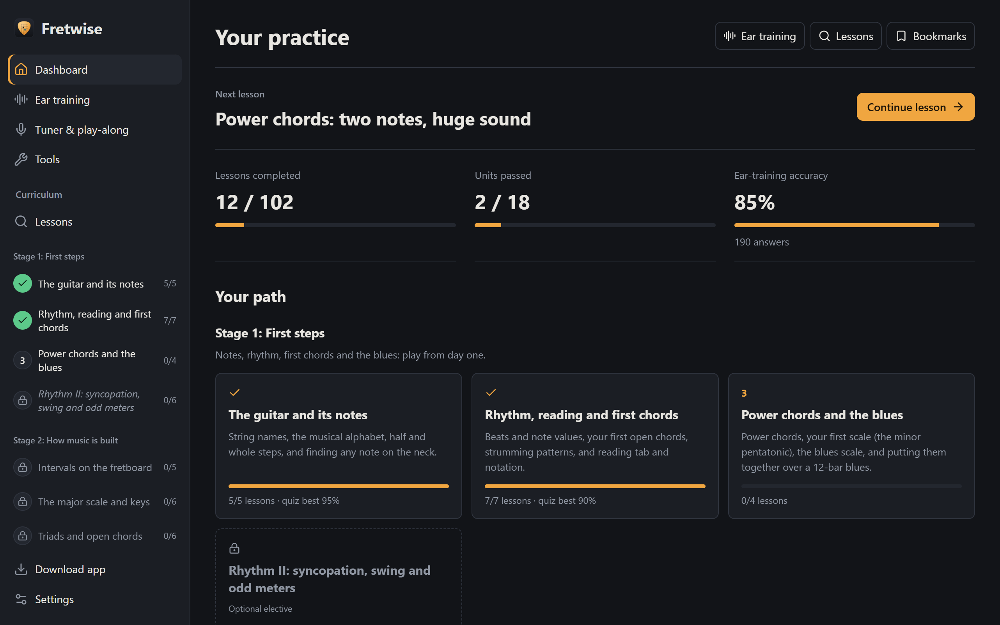
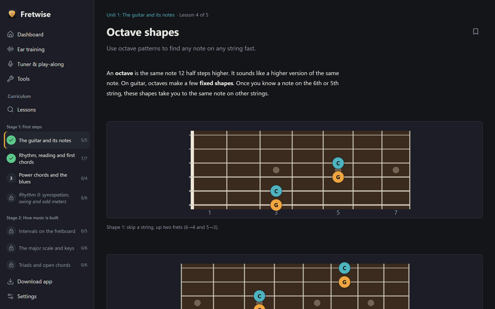
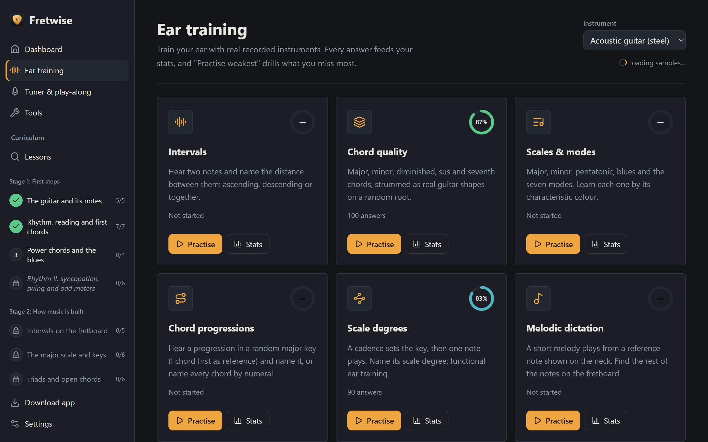
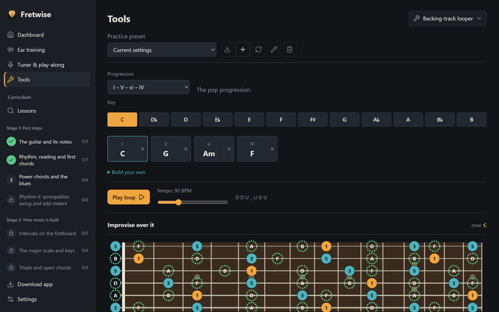
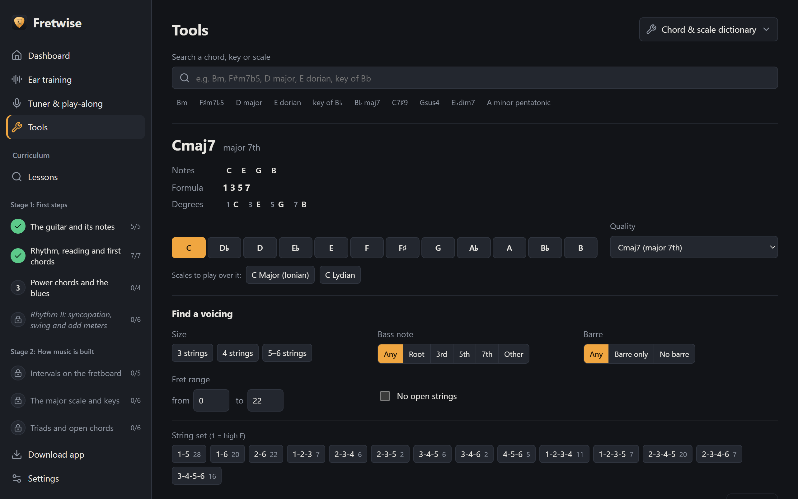
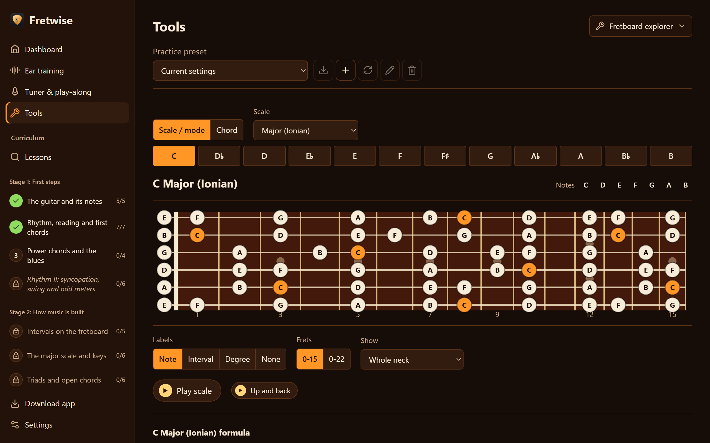
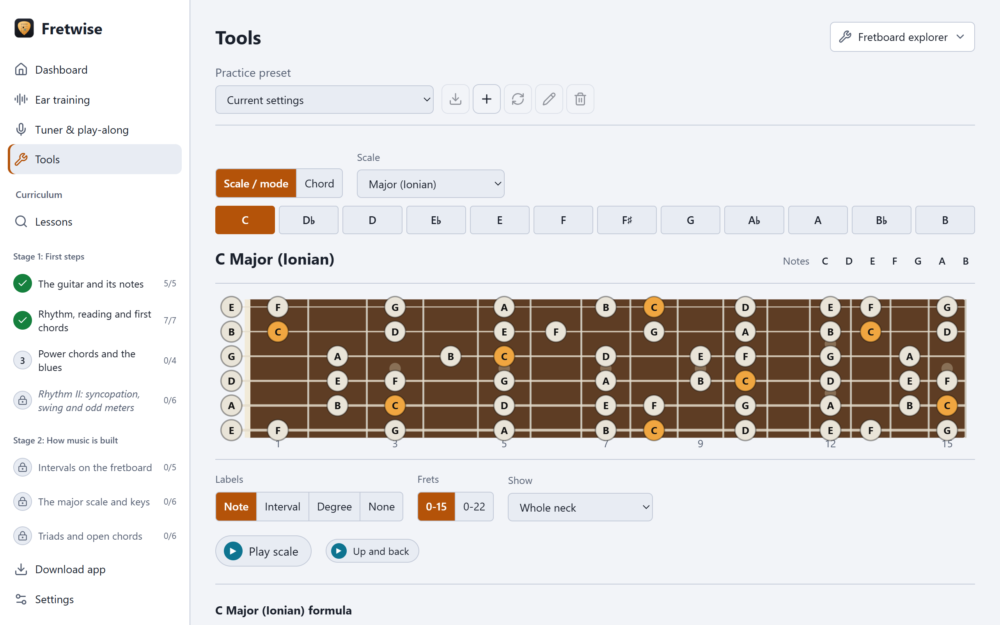
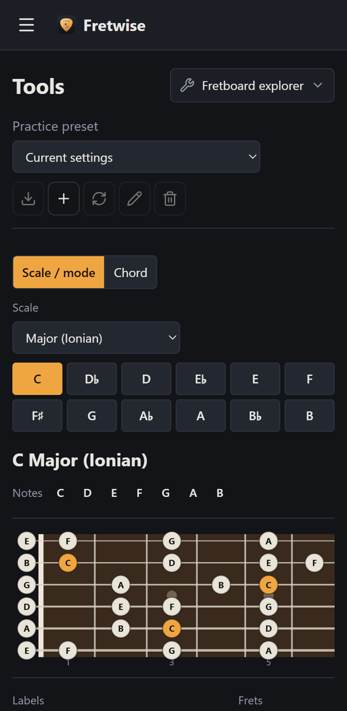

<div align="center">



# Fretwise

**Music theory for guitarists, taught on the fretboard.**

102 lessons, ear training, a tuner and ten practice tools.<br>
Every idea is shown on the neck and played with real recorded guitar samples.

[](https://fretwise.eidsonbrady.com)
[](https://github.com/Subterfugus/fretwise/releases/latest/download/Fretwise-Setup.exe)

[](https://github.com/Subterfugus/fretwise/releases/latest)
[](LICENSE)

<br>

<a href="https://fretwise.eidsonbrady.com"></a>

</div>

## Get it

- **In a browser:** open <https://fretwise.eidsonbrady.com>. There is nothing to install, it works on phones, and your progress is saved in that browser.
- **On Windows:** download [Fretwise-Setup.exe](https://github.com/Subterfugus/fretwise/releases/latest/download/Fretwise-Setup.exe). It works offline. The installer is not code-signed, so Windows SmartScreen may warn before it runs.

Progress can be exported to a file and imported again, so you can move between the two.

## A look around

<table>
  <tr>
    <td width="50%"><br><b>A path, not a pile.</b> 18 units in five stages. Pass a unit's quiz to unlock the next.</td>
    <td width="50%"><br><b>Lessons on the neck.</b> Each idea comes with a fretboard diagram you can hear.</td>
  </tr>
  <tr>
    <td><br><b>Ear training.</b> Seven drills that track what you miss and drill it again.</td>
    <td><br><b>Backing-track looper.</b> Loop a progression and see the target tones change with each chord.</td>
  </tr>
  <tr>
    <td><br><b>Chord and scale dictionary.</b> Search any chord, key or scale and filter its voicings.</td>
    <td><br><b>Seven themes.</b> This is Sunburst. There are light and high-contrast themes too.</td>
  </tr>
</table>

<details>
<summary>Light theme and phone layout</summary>
<br>
<table>
  <tr>
    <td width="75%"></td>
    <td width="25%"></td>
  </tr>
</table>
</details>

## What's in it

- **Curriculum:** 102 lessons in 18 units (13 core, 5 electives), grouped into five stages from first steps to jazz harmony. You play first and get the explanation later: open chords, power chords, the minor pentatonic and the 12-bar blues all come in stage 1.
- **Quizzes:** one per unit, mixing fixed questions with randomly generated ones. Pass with 80% to unlock the next unit.
- **Ear training:** seven drills (intervals, chord quality, scales and modes, progressions, scale degrees, melodic dictation, note finder) with per-item stats.
- **Tuner and play-along:** the app listens to your guitar through the microphone and checks single notes.
- **Tools:**
  - chord and scale dictionary
  - chord identifier
  - fretboard explorer
  - backing-track looper with live target tones
  - voice leading explorer
  - reharmonisation
  - triads
  - note finder
  - scale comparison
  - metronome
- **Settings:** seven themes (including light and high contrast), a left-handed fretboard, a choice of sharps or flats for note names, and progress export and import (a JSON file that works in both the desktop app and the web version).

## Build from source

Needs Node.js 22 or later.

```bash
npm install
npm run dev
```

The instrument samples are included in the repository, so the app works offline.

## Commands

| Command | What it does |
| --- | --- |
| `npm run dev` | Launches the Electron app with hot reload |
| `npm test` | Runs the test suite (Vitest) |
| `npm run typecheck` | TypeScript check |
| `npm run build:win` | Builds a Windows installer into `dist/` |
| `npm run build:web` | Builds the browser version into `dist-web/` |
| `npm run deploy:web` | Builds the browser version and deploys it to Cloudflare (<https://fretwise.eidsonbrady.com>) |
| `npx vite --config vite.preview.config.ts` | Runs the interface alone in a browser at `http://localhost:5199` |
| `npm run fetch-samples` | Re-downloads the instrument samples (only needed if they are missing) |
| `npm run render-icon` | Regenerates the app icon from `build/icon.svg` |

## Layout

- `src/main`: Electron main process. It serves the app and saves progress to `progress.json` in the app's user-data folder.
- `src/preload`: the bridge between the main process and the interface (`window.fretwise`).
- `src/renderer/src/theory`: pure TypeScript music theory: notes, intervals, scales, chords, keys, tunings and fretboard maths.
- `src/renderer/src/audio`: the Tone.js sampler engine.
- `src/renderer/src/content`: lessons and quizzes. `curriculum.ts` sets the teaching order; `units/` holds the lessons.
- `src/renderer/src/features`: lessons, quiz, ear training, mic, tools, dashboard and settings.
- `src/renderer/src/state`: saved progress, unlocking and presets.

For architecture, design decisions and project status, see [info.md](info.md).

## Licence

The code and lesson content are released under the [MIT licence](LICENSE). The instrument samples are third-party recordings under CC-BY 3.0 (see Credits) and keep that licence.

## Credits

- Instrument samples: [tonejs-instruments](https://github.com/nbrosowsky/tonejs-instruments) by Nicholaus P. Brosowsky, CC-BY 3.0
- [Tone.js](https://tonejs.github.io/) for audio
- [VexFlow](https://www.vexflow.com/) for notation
